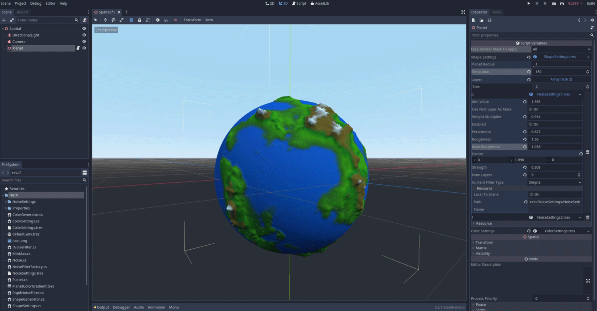

# ProceduralPlanet
Procedural planet creation tool done with Godot Engine 3.2.1 Mono Version.
This tool was created using as inspiration the tutorials from [Sebastian Leage](https://www.youtube.com/watch?v=QN39W020LqU&list=PLFt_AvWsXl0cONs3T0By4puYy6GM22ko8) who did this for Unity 3D.
So if you need more details about how this works, go and take a look at his amazing materials.

You can edit your own planet using this tool and modify
* Colors using a gradient
* Generate a random shape using several noise layers
* Set the resolution for your planet model
* Partly render independent faces of the Sphere

In order to color the model I did the following simple shader that put color based on a texture generated from a gradient:

```
shader_type spatial;

uniform vec2 elevation;
uniform vec3 center;
uniform sampler2D gradient;

varying float point_length;


// generate a value between start and end based on t -> [0, 1]
//t=0 gives me start, t=1 gives me end
float lerp(float start, float end, float t) {
	return start * (1.0 - t) + end * t;
}

//generate a valaue between 0 and 1 based on start and end
float inverse_lerp(float start, float end, float t) {
	if (end - start < 0.0) {
		return start;
	}
	return (t - start) / (end - start);
}

void vertex() {
	point_length = distance(VERTEX, center);	
	//point_length = length(VERTEX); //could be used as well
}

void fragment() {	
	//x = min; y = max values generated
	float uv = inverse_lerp(elevation.x, elevation.y, point_length);
	vec4 sample = texture (gradient , vec2(uv,uv));
	ALBEDO = sample.xyz;
}


``` 


Take a look at the final results:

 


